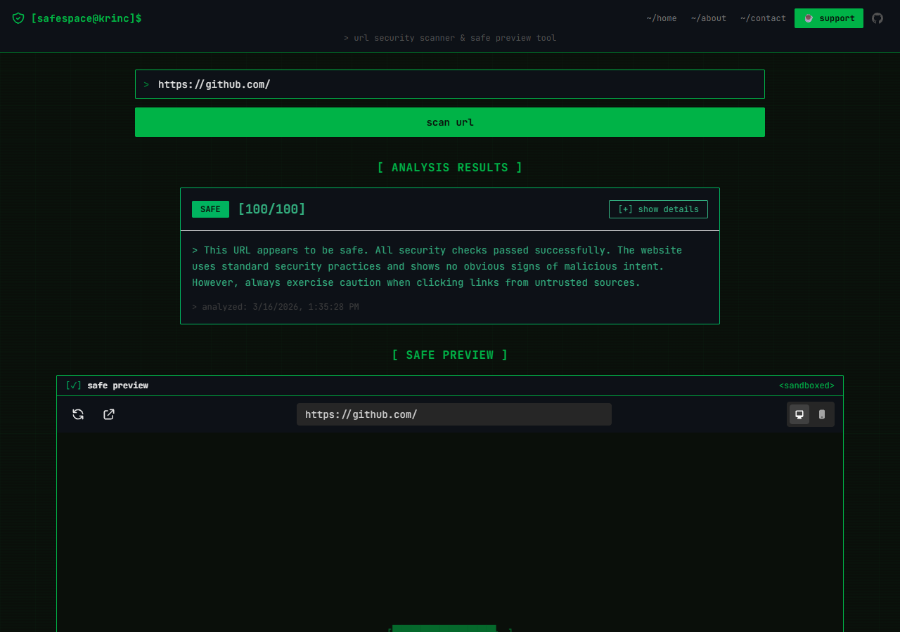
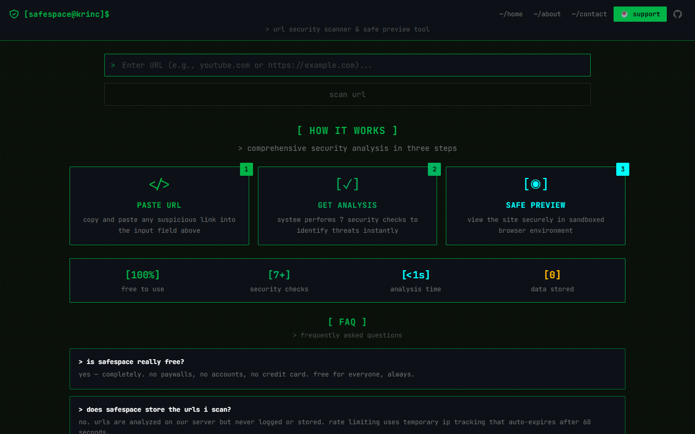
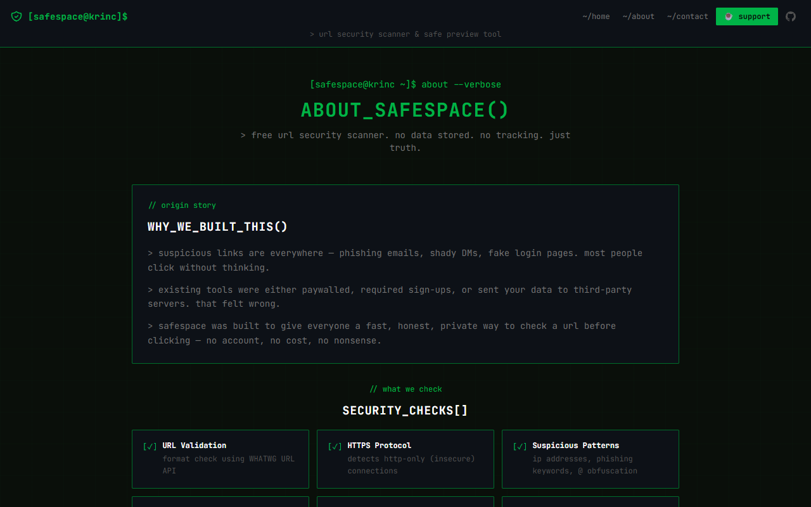

# SafeSpace

**Free URL Security Scanner — check suspicious links before you click.**

No sign-up. No data stored. Paste any URL and get an instant security analysis with a sandboxed safe preview.

🌐 **Live:** [safespace.krinc.in](https://safespace.krinc.in) &nbsp;|&nbsp; ⭐ **Star on GitHub** if it helped you!

---



---

## What It Does

SafeSpace runs 7 security checks on any URL and gives it a safety score from 0–100:

| Check | What it detects |
|---|---|
| **URL Validation** | Format check using the WHATWG URL API |
| **HTTPS Protocol** | Flags insecure HTTP connections |
| **Suspicious Patterns** | IP addresses, brand impersonation, phishing keywords, @ tricks |
| **Domain Analysis** | Risky TLDs, long domains, numeric domains |
| **Domain Age** | Heuristic estimation of domain trustworthiness |
| **URL Length** | Flags abnormally long URLs (>200 chars) |
| **Special Characters** | Detects encoding tricks and obfuscation |

**Scores:** `80–100 = SAFE` &nbsp;|&nbsp; `50–79 = SUSPICIOUS` &nbsp;|&nbsp; `<50 = DANGEROUS`

If the URL passes, a **sandboxed live preview** loads inside the page — no need to open it in a new tab.

---

## Homepage



---

## About Page



---

## Privacy

- URLs are analyzed **server-side** but **never stored or logged**
- No user accounts, no cookies, no tracking scripts
- Rate limiting is IP-based and auto-expires after 60 seconds
- Fully open-source — audit every line

---

## Tech Stack

- **Next.js 14** — App Router, TypeScript, strict mode
- **Tailwind CSS** — custom cyberpunk terminal theme
- **Zod** — strict input validation
- **LRU Cache** — in-memory rate limiting
- **API Routes** — server-side analysis, CORS proxy, screenshot service

---

## Getting Started

```bash
git clone git@github.com:iKrinc/safespace.krinc.in.git
cd safespace.krinc.in
npm install
npm run dev
```

Open [http://localhost:3000](http://localhost:3000).

```bash
# Build for production
npm run build
```

---

## API

### `POST /api/analyze`

```json
// Request
{ "url": "https://example.com" }

// Response
{
  "url": "https://example.com",
  "safetyLevel": "SAFE",
  "score": 100,
  "checks": [...],
  "explanation": "This URL appears to be safe...",
  "timestamp": "2026-03-16T00:00:00.000Z",
  "canPreview": true
}
```

---

## Project Structure

```
app/
├── api/
│   ├── analyze/route.ts    # URL analysis endpoint
│   ├── preview/route.ts    # Preview availability check
│   └── proxy/route.ts      # CORS proxy
├── about/page.tsx
├── contact/page.tsx
├── layout.tsx              # Root layout with Header + Footer
└── page.tsx                # Homepage
components/
├── Header.tsx
├── Footer.tsx
├── URLInput.tsx
├── AnalysisResults.tsx
└── SafePreview.tsx
lib/
├── urlAnalyzer.ts          # Analysis orchestration
├── securityChecks.ts       # All 7 security check functions
├── rateLimit.ts            # LRU-based rate limiting
└── proxyFetch.ts           # CORS proxy fetch logic
```

---

## Deployment

- **Vercel** (recommended) — push to GitHub and connect; zero config
- **Any Node host** — `npm run build && npm start`

---

## Limitations

- SafeSpace uses heuristic analysis, not a live threat database. No automated tool is 100% accurate — use it as one layer of defense alongside caution.
- The sandboxed preview will show blank for sites that block iframe embedding (X-Frame-Options / CSP). This is expected behavior.

---

## Contributing

1. Fork the repo
2. Create a branch: `git checkout -b feat/your-feature`
3. Commit changes and open a pull request

Bug reports → [GitHub Issues](https://github.com/iKrinc/safespace.krinc.in/issues)

---

## Support

SafeSpace is free and always will be. If it kept you safe:

❤️ [Sponsor on GitHub](https://github.com/sponsors/iKrinc) — keeps the servers running.

---

## License

MIT © [Krinc](https://krinc.in)
